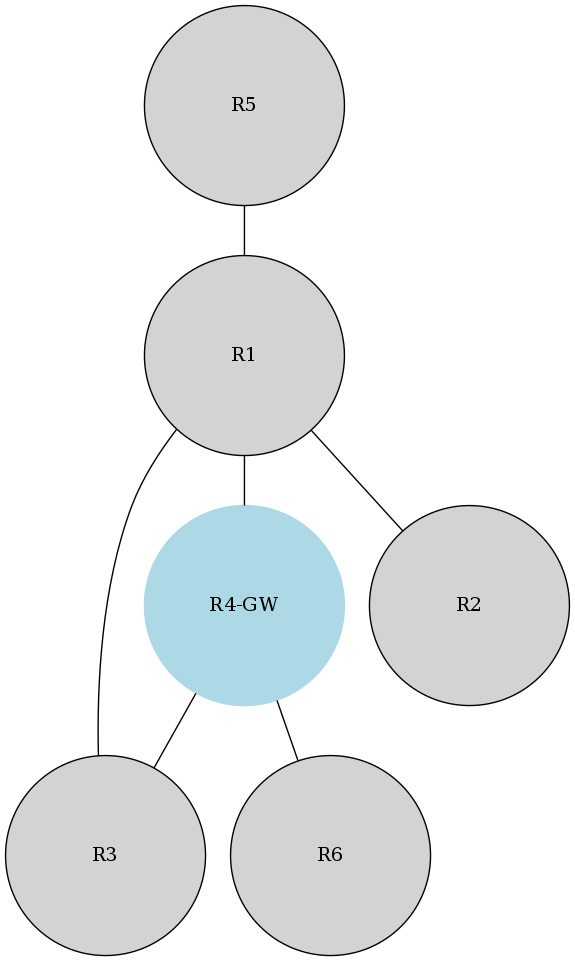

# Overview

This script will read in topology information (nodes and edges) from a JSON  
file, build a topoology graph, generate a topology diagram and produce  
various reports about the topology.

Install the following prerequisites:
```bash
sudo -H pip3 install networkx matplotlib
sudo -H pip3 install pydot
sudo apt-get install graphviz
```

### Usage

First extract the network topology from a CMDB/DCIM system which stores  
devices and the links between them. Then simply run the script and point it  
at the topology JSON file to generate the reports and diagram:
```bash
bensley@LT-10383(example_net_2)$../../draw_from_json.py
Graph details:
Name:
Type: Graph
Number of nodes: 32
Number of edges: 40
Average degree:   2.5000

/usr/local/lib/python3.5/dist-packages/networkx/drawing/nx_pylab.py:611: MatplotlibDeprecationWarning: isinstance(..., numbers.Number)
  if cb.is_numlike(alpha):
Computed paths for 32 node(s), computed weights for 32 node(s)
Computed shortest paths for 32 node(s), computed weights for 32 node(s)
```

This script is expecting to find some nodes with "-GW" in the `id` field of  
the topology file, these are the Gateway or Area Border Routers for this IGP  
area.  

### Examples

* [examples/basic_network](examples/basic_network) - A simple 5 node network example with one ABR Area Border Router.
* [examples/example_net_1](examples/example_net_1) - Shows a real network as an example which has mode nodes and links.
* [examples/example_net_2](examples/example_net_2) - Shows the same real network, further through the build process with more links/resiliency and dual ABRs available to all nodes.

Basic Network Output:  
```bash
bensley@LT-10383(basic_network)$../../draw_from_json.py
Graph details:
Name:
Type: Graph
Number of nodes: 6
Number of edges: 6
Average degree:   2.0000

/usr/local/lib/python3.5/dist-packages/networkx/drawing/nx_pylab.py:611: MatplotlibDeprecationWarning: isinstance(..., numbers.Number)
  if cb.is_numlike(alpha):
Report directory doesn't exist: ./reports
Created directory: ./reports
Computed paths for 6 node(s), computed weights for 6 node(s)
Computed shortest paths for 6 node(s), computed weights for 6 node(s)

bensley@LT-10383(basic_network)$head reports/closest_abr_to_node.txt
Closest ABR to each node:
Node: R1, ABR: R4-GW, Weight: 10
Node: R2, ABR: R4-GW, Weight: 20
Node: R3, ABR: R4-GW, Weight: 10
Node: R5, ABR: R4-GW, Weight: 20
Node: R6, ABR: R4-GW, Weight: 10
```

