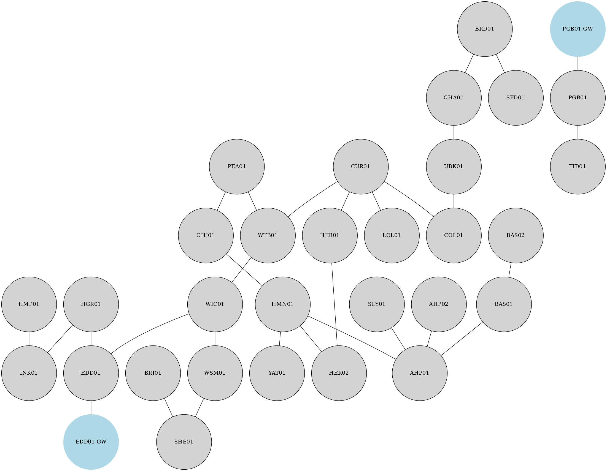

# Example Network 1

A real IGP area / level which has two ABRs towards the backbone (EDD01-GW and  
PGB01-GW). There are quite a few non-resilient parts of the network which is  
recorded in the reports.  

