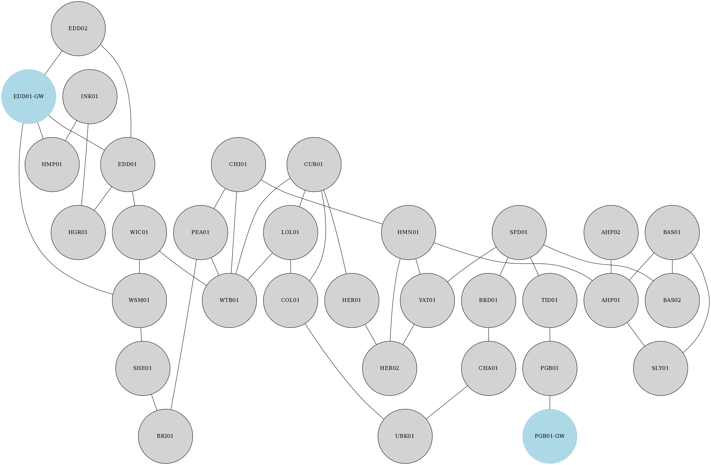

# Example Network 2

A real IGP area / level which has two ABRs towards the backbone (EDD01-GW and  
PGB01-GW). This is the same network as [Example Network 1](../example_net_1)  
with more links added in. This is reflected in the report, they show that  
these are fewer non-resilient strings for example.  

